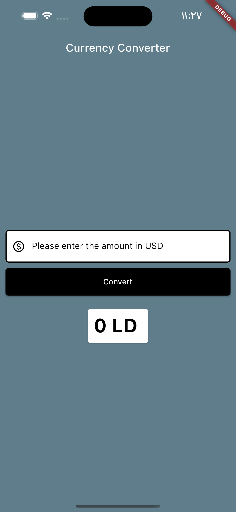
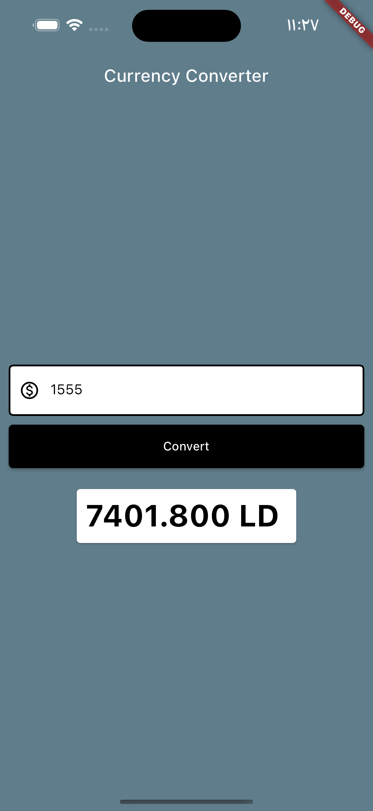

# Currency Converter App

This project is a simple currency converter application that converts USD to another currency. It is built with Flutter, allowing it to run on both Android and iOS platforms.

## How It Works

The application includes two pages, one styled according to Material design guidelines (Android style) and another following Cupertino design language (iOS style). 

Upon opening the app, users will be presented with an input field to enter the amount in USD they wish to convert. Once the amount is input, users can press the "Convert" button to perform the conversion. The result of the conversion will be displayed below the button.

The conversion rate used in this app is hardcoded as 4.76. This means the app currently converts USD to a currency with this rate. In a real-world application, you'd likely want to fetch current exchange rates from a reliable API.

## Project Structure

The project is organized into three primary Dart files:

1. `main.dart`: This is the entry point of the application. It initializes the app and sets either `MyApp` (for Material design) or `MyCupertinoApp` (for Cupertino design) as the root widget.

2. `currency_converter_material_page.dart`: This file defines a Material-style page for converting currencies. It contains a TextField for input (USD amount), a "Convert" button, and a Card to display the result.

3. `currency_converter_cupertino_page.dart`: This file defines a Cupertino-style page for converting currencies. The layout and behavior are very similar to the Material page, using Cupertino widgets for a design that aligns with iOS.

## Preview Images

  
  

